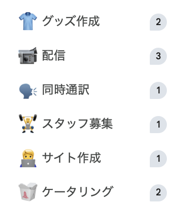

# Conference Organizing Knowledge Skill

Google Docsとして公開されている[カンファレンス開催ノウハウ](https://docs.google.com/document/d/1b0GAEADYCefXw4GZNTO6mktZDhZ-hno7QIziqh54W4I/edit?usp=sharing)をClaude CodeのSkillとして提供するプラグイン。
GitHub Actionsにより3日ごとにDocsの内容を自動同期している。

## Skillの導入

マーケットプレイスの追加とプラグインのインストールを行う。

```sh
claude plugin marketplace add fec-nagoya-org/conference-organizing-knowledge
claude plugin install conference-organizing-knowledge-skill@conference-organizing-knowledge-skill
```

インストール後、カンファレンス開催に関する質問をすると自動的にSkillが参照される。

## カンファレンス開催ノウハウとは

カンファレンスを開催する上で注意すべき点を有志でまとめ、主にこれからイベントを主催するスタッフの間で共有できることを目的に作成されたドキュメント。



## 開発Docs

このリポジトリの開発に関するドキュメントは[こちら](./docs/development.md)
